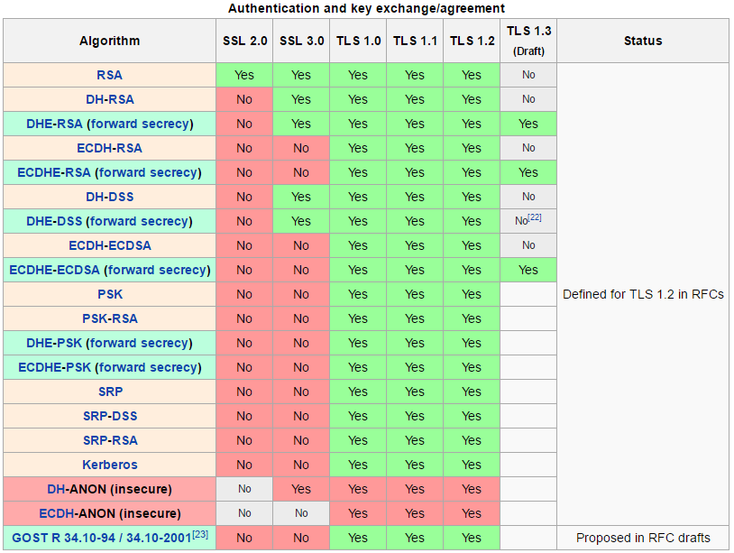

Greta
==

# Gateways 

## Theory

### Definition

> Gateway
  1. An entrance or passage that may be closed by a gate.
  2. A structure for enclosing such an opening or entrance.
  3. Any passage by or point at which a region may be entered.
  4. Software or hardware that links two computer networks.

> Gateways are “Traffic controllers” that bridge data generation to support a range of connectivity protocols and satisfy complex management. Gateways are also called middleware development devices because they are found "in the middle" of an IoT solution. They can filter and aggregate data, secure remote management, save temporal data, have cloud connectivity and device interconnectivity.

#### Important Gateways of the World

> Gateways are a vital means of connecting people, places and things to facilitate commerce and improve our lives.
>http://www.intel.com/content/www/us/en/internet-of-things/gateway-solutions.html
>https://blogs.intel.com/iot/2014/09/12/intel-panama-common/

### Architecture

> The architecture of an Intel gateway consists in 4 basic layers with their correspondant suplayeers. At the bottom we have an Intel Board and Modules (Intel Quark SoC, Intel Atom SoC, Intel Core SoC). Above this layer we have a Wind River Linux Operating System. Above this Operating System layer we have the modules that make a gateway a data controller solution. In this layer we have hardware (discrete TPM and Secure Boot), Run-Time Environment which could be Lua, Java, Python or OSGi, Manageability with Wind River Helix Device, OMA DM, TR-069, and web configuration. There we have too a security layer that has enabled OpenSSL, iptables, encrypted storage, DM-Crypt and an IPsec VPN. 

http://www.windriver.com/announces/intel-gateway-solutions-for-iot/resources/IDP_XT_Product_Overview.pdf

### Justification

> Gateways give developers the flexibility to create and deploy innovative, cost-effective and secure Internet of Things solutions for a wide array of business segments.

> Connectivity is critical to generating intelligence.
Without connectivity, there is no either Smart or Internet in the IoT.

>Can:
* Reduce the cost of backend cloud
* Reduce latency, actions executed immediately
* Prefer having data locally than in the cloud
* Protocol Consolidation
* Edge to Cloud Connectivity
* Remote I/O
* Scalability
* Support for multiple protocols
* Application Software

> https://www-ssl.intel.com/content/www/us/en/embedded/solutions/iot-gateway/overview.html
> http://www.windriver.com/announces/intel-gateway-solutions-for-iot/

### Applications

> Buildings: Adaptive analytics can improve the accuracy and performance of systems used to monitor and manage energy consumption, climate control, lighting, mechanical equipment and security.
> Energy: Devices can adjust the speed and blade pitch of wind turbines to improve efficiency and reduce wear.
> Transportation: Smart control systems can tell trains to slow down based on a variety of constantly changing external data inputs, such as weather, topography, location, distance from destination, track conditions, or car-to-car communication indicating another train is ahead.

> http://www.windriver.com/announces/intel-gateway-solutions-for-iot/

## Hands-On

1. Review the following gateways models
   1.1 Intel DK50, DK100, DK200, DK300.
   1.2 Dell Edge Gateway 5000.
   1.3 Advantech UTX-3115.
2. List the Communications and Connectivity found in the above gateways
3. What are the Operating Systems supported by different the gateways?

http://www.intel.com/content/www/us/en/embedded/solutions/iot-gateway/development-kits.html

# Wind River 

## Intelligent Device Platform XT

### Theory

#### Definition

> Is a customizable middleware development environment that provides security, connectivity, rich networking options, and device management. It simplifies the development, integration, and deployment for the Internet of Things.

- Extract value and transform your business
- Intelligent gateways provides a smooth interface between devices and the cloud
- Extend legacy systems with intelligent gateways
- Compute capacity powers growth
- Gateways enable new capabilities
- Ensure connectivity with gateways
- Remotely manage and troubleshoot devices
- More connectivity requires greater security
- Trust your network, trust your data
- Transform your business today

#### Architecture

> To be added (links, information)
> To be structure what are the components, etc e.g. https://www.youtube.com/watch?v=yj5gGxncPlA

#### Differences

##### Operating Systems
>  Intel® IoT Gateways offer a choice of Intel® processors for different application needs, support for multiple operating systems (Wind River and Ubuntu* Linux,* Microsoft Windows* 10, etc.), and robust device management capabilities.
> * Intel® IoT Gateways are the result of Intel’s collaboration with McAfee and Wind River. By providing pre-integrated, pre-validated hardware and software building blocks, the gateways connect legacy and new systems, and enable seamless and secure data flow between edge devices and the cloud.

##### Security McAffee

> McAfee Embedded Control* maximizes security by dynamically monitoring and managing whitelists. 
> *Verify system integrity at the hardware level to protect critical data throughout the device lifecycle.*
http://www.intel.com/content/www/us/en/embedded/solutions/iot-gateway/development-kits.html

## Wind River Company

1. What is Wind River®?
World leader in embedded software for intelligent connected systems.
Delivers the technology and expertise that enables the innovation and deployment of safe, secure, and reliable intelligent systems.
2. Products of Wind River
Portfolio of software solutions for harnessing intelligence 
to drive innovation and business transformation.
Developers and device manufacturers can create the safe, 
secure, and reliable intelligent systems that make up IoT.
Also, move the data generated by these systems–from 
the secure and managed devices, through the gateway, 
across the critical network infrastructure, and up into the cloud. 
Wind River Helix: The Software Foundation for the Internet of Things
* Operating Systems
* Network Infrastructure
* Gateways
* Edge Management
* Simulation
* Open Networks

## Wind River IoT Building Blocks

> Devices: The “things” in the Internet of Things. 
By 2020, these data generators and gatherers will number 26 billon, 
all connected to the Internet and providing businesses with endless data from which to analyze and extract value and meaning.
> Gateways: “Traffic controllers” bridge data generation to support an ever-broadening range of connectivity protocols and satisfy complex management.
> Networks: This complex interconnected infrastructure for delivering data to every corner of industry and enterprise networks must be optimized for maximum agility, scalability, flexibility, and security.
> Cloud: Comprising public, private, and hybrid forms, this off-premise storage faces a daunting surge in analytic, security, and reliability challenges to keep pace with the uptime demands of critical infrastructure and trusted systems designed to leverage IoT.

Abraham to add more data

# Security 

## Importance of Security

> To be added (links, information)
> As the IoT grows, so do the security vulnerabilities of the linked objects.
> With the arrival of IoT several new types of devices are connected to IP networks.
-Medical equipment
-Buildings
-Cameras
-Industrial sensors
-Many other devices.

All these devices need management Access to transport data securely over the internet.

## Security in Non IoT Solutions Vs IoT Solutions

> To be added (links, information)
> 
> How can new enterprise implementations secure their data flow?

## Secure Data Traffic

> To be added (links, information)
> Focuses on protecting critical data.
> Any data traffic between a device and the cloud (including information transmitted via mobile apps) should be examined to make sure it is secured.

## Cryptography Protocols
> SSL & TLS are protocols that provide data encryption and authentication between applications and servers in scenarios where that data is being sent across an insecure network, such as checking your email.
  > Which is the most famous usage of SSL & TLS?
> Secure Sockets Layer (SSL)
  > SSL protects data in transit by encrypting it.
> Transport Layer Security (TLS)
  > SSL's more secure "successor", TLS is the new version of SSL, 
  > TLS also encrypts data in transit and requires a handshake between two authorized servers before it shows its contents.
### Handshake
Is a sub-protocol used to negotiate session information between the client and the server. The session information consists of a session ID, peer certificates, the cipher spec to be used, the compression algorithm to be used, and a shared secret that is used to generate keys.
### Encryption
> These two protocols work on the same level of encryption.
> The source and the destination must have the correct SSL/TLS certificate in order to do a correct handshake.

### In which layer these two protocol are?
>The OSI model does not work with SSL/TLS. TLS is not in any layer.
  >SSL/TLS uses an underlying transport medium that provides a bidirectional stream of bytes. That would put it somewhere above layer 4.
  >SSL/TLS organizes data as records, that may contain, in particular, handshake messages. Handshake messages look like layer 5. This would put SSL/TLS at layer 6 or 7.
  >What SSL/TLS conveys is "application data", which is, in fact, a bidirectional stream of bytes. Applications that use SSL/TLS really use it as a transport protocol. They then use their own data representation and messages and semantics within that "application data". 
  >Therefore, SSL/TLS could not be, in the OSI model, beyond layer 4.
### Should I choose TLS or SSL?
### What happens if I do not select either one?
> All of your data traffic and your login information are sent in plain text for anyone to see.
> There is no guarantee that the server you connect to is not some middle man or interloper.
Review Secure Sockets Layer (SSL) Transport Layer Security (TLS).

http://security.stackexchange.com/questions/5126/whats-the-difference-between-ssl-tls-and-https
https://luxsci.com/blog/ssl-versus-tls-whats-the-difference.html
http://www.tomsguide.com/us/ssl-vs-tls,news-17508.html
https://httpd.apache.org/docs/2.4/ssl/ssl_intro.html
http://security.stackexchange.com/questions/93333/what-layer-is-tls

## Hardware Security Solutions
###Discrete TPM
>Discrete Trusted Platform Module (TPM) is a microcontroller that stores encryption keys, passwords and digital certificates. 
>The discrete form is the silicon module was separated from other system elements and communicated with them via a dedicated hardware bus.
###Secure Boot
>Secure Boot is a security standard developed by members of the PC industry to help make sure that your PC boots using only software and hardware modules that are trusted by the PC manufacturer.
>What happens if a new hardware isn’t trusted? 
>How do I edit my PC’s Secure Boot database? 
>How can I add hardware or run software or operating systems that haven’t been trusted by my manufacturer? 

http://www.jhuapl.edu/techdigest/TD/td3202/32_02-Osborn.pdf
https://technet.microsoft.com/en-us/library/mt604232(v=vs.85).aspx
https://technet.microsoft.com/en-us/library/hh824987.aspx
## Software Security Solutions
### Firmware TPM
PM) based component running in a trusted execution environment (TEE) on the system’s main SoC:
On Intel chips, it is the Intel Management Engine (ME) or Converged Security Engine (CSE).
### Mocana NanoSSL

> To be added (links, information)

### WolfSSL

> To be added (links, information)

### Mosquitto and Mosquitto SSL

> To be added (links, information)

## Hands-On

1. Main differences between NanoSSL, Mosquitto SSL, and WolfSSL.
2. ...

# Helix Cloud
App Cloud
Software development platform.
Wind River Rocket (ideal for building sensors, wearables, industrial controllers) 
& Wind River Pulsar Linux  (small, high-performance, Linux ).

Lab Cloud
Is an instantly accessible software lab that improves team collaboration and makes Internet of Things (IoT) development easier for everyone.

Device Cloud
is a ready-made, cloud-based platform for the Internet of Things (IoT).
Reduces the complexities of building and rolling out large-scale embedded device networks.

