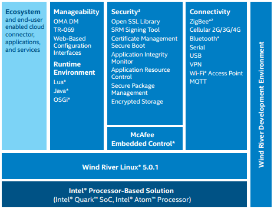

Intel® IoT Gateways
==
> Intel® IoT Gateways connect legacy and next generation intelligent infrastructure reducing time-to-market and development cost with open architecture pre-validated solutions.

> Intel® IoT Gateways are preconfigured with Wind River Helix Device Cloud agent, it provides easy connectivity to facilitate device configuration, data capture, file transfers, etc.

- [Intel® IoT Gateways Homepage](https://www-ssl.intel.com/content/www/us/en/embedded/solutions/iot-gateway/overview.html)
- [Intel® IoT Gateways: Publishing Data to an MQTT Broker Using Python](https://software.intel.com/en-us/SetupGateway-MQTT)
- [Getting Started with Intel® IoT Gateways with Intel® IoT Developer Kit 3.5](https://software.intel.com/en-us/getting-started-with-intel-iot-gateways-and-iotdk)



Intel Gateway Solutions for IoT provides:

- Connectivity up to the cloud and enterprises
- Connectivity down to sensors and existing controllers embedded in the system
- Preprocess filtering of selected data for delivery
- Local decision-making, enabling easy connectivity to legacy systems
- A hardware root of trust, data encryption, attestation, and software lockdown for security
- Local computing for in-device analytics.

## Partners

### McAfee

> Intel Security Group (previously McAfee, Inc. /ˈmækəfiː/) is an American global computer security software company headquartered in Santa Clara, California, and the world's largest dedicated security technology company. [Wikipedia](https://en.wikipedia.org/wiki/Intel_Security)

### Wind River

> Wind River is a subsidiary company of Intel providing embedded system software which comprises run-time software, industry-specific software solutions, simulation technology, development tools and middleware. [Wikipedia](https://en.wikipedia.org/wiki/Wind_River_Systems)


Intel® IoT Gateway Development Kit Features:

- Fully-configured compute board, wireless communications, security software, operating system, development tools, chassis, power supply, antennas, and documentation.
- Standards-based interfaces for I/O, cellular, and Wi-Fi simplify communications down to sensors and controllers and up to datacenters and the cloud. 
- Board support package (BSP), Wind River Linux* 5 OS, Wind River Intelligent Device Platform* XT, and Wind River Workbench* development environment with perpetual licensing.
- McAfee Embedded Control* maximizes security by dynamically monitoring and managing whitelists. 

- [Intel® IoT Gateway and Snappy Ubuntu Core* from Canonical: Solution Brief](http://www.intel.com/content/www/us/en/embedded/solutions/iot-gateway/intel-and-canonical-snappy-ubuntu-core-solution-brief.html)
- [Intel® IoT Gateways: Get Started](https://www-ssl.intel.com/content/www/us/en/embedded/solutions/iot-gateway/overview.html)
- [2015 IoT Solutions World Congress Barcelona](http://www.intel.co.uk/content/www/uk/en/internet-of-things/events/iot-solutions-world-congress-barcelona-2015.html)
- [IoT Gateways Search Results @ Intel Site](http://www.intel.es/content/www/es/es/search.html?toplevelcategory=Embedded&keyword=iot+Gateway&%3Acq_csrf_token=undefined#keyword%3Diot%20gateway&filters%3DTarget%20Audience%7CTarget%20Audience%2FEmbedded%20Developers%20%23amp%3B%20Engineers&shadowFilters=)
- [Connect an Intel® IoT Gateway to IBM IoT Foundation](https://developer.ibm.com/recipes/tutorials/connect-an-intel-iot-gateway-to-iot-foundation/)
- [Github Recipes for Intel IoT Gateways](https://github.com/intel-iot-devkit/Intel-IoT-Gateway)
- [Intel® IoT Gateway Development Kits](http://www.intel.com/content/www/us/en/embedded/solutions/iot-gateway/development-kits.html)
- [Intel® IoT Gateway and Snappy Ubuntu Core* from Canonical: Solution Brief](http://www.intel.com/content/www/us/en/embedded/solutions/iot-gateway/intel-and-canonical-snappy-ubuntu-core-solution-brief.html)
- [Computex: Intel updates IoT Gateway with support for Snappy Ubuntu Core](http://www.theinquirer.net/inquirer/news/2411353/computex-intel-updates-iot-gateway-with-support-for-snappy-ubuntu-core)
- [Wind River* Linux 7 and IDP XT* 3.0 is now available on Intel® IoT Gateways](https://software.intel.com/en-us/blogs/2015/08/07/wind-river-linux-7-and-idp-xt-30-is-now-available-on-intel-iot-gateways-for-select)
- [Intel® Gateway Solutions for the Internet of Things](http://www.mouser.com/catalog/specsheets/intel_SolutionsForIoT_330184-02.pdf)
- https://software.intel.com/en-us/blogs/2016/01/14/my-experiences-at-idf-2015-as-a-black-belt-developer-the-intel-iot-gateway


- [DK50 Getting Started](http://www.intel.es/content/www/es/es/embedded/design-tools/evaluation-platforms/gateway-solutions/gateway-solutions-iot-dk50-dev-kit-getting-started-guide.html)
- [DK100 Getting Started](http://www.intel.com/content/www/us/en/embedded/design-tools/evaluation-platforms/gateway-solutions/dk100-development-kit-getting-started-guide.html)
- [DK200 Getting Started](http://www.intel.com/content/www/us/en/embedded/design-tools/evaluation-platforms/gateway-solutions/dk200-development-kit-getting-started-guide.html)

### Wind River® Linux 5.0 / 5.1

- Wind River Linux Overview
- Development & Build Environment
- Configuration and Build
- Layers & Recipes
- Userspace & Kernel Development
- Debugging

### Wind River® Intelligent Device Platform XT 2.0

> The Foundation for Building Devices That Connect to the Internet of Things

> The Wind River Intelligent Device Platform* XT includes the development tools you need to build and customize a target system based on Intel® IoT Gateways.

> The Wind River Intelligent Device Platform XT (IDP XT) packages the Wind River commercialgrade Linux development platform with security and management tools for gateways.

> IDP XT provides integrated development and management support for distributed systems that utilize smart services with cloud computing. It includes secure remote management layer for cloud-based smart services, including automated customer interaction and support.

- Wind River Intelligent Device Platform Overview
- Architecture
- Security, Connectivity & Management
- Validation
- System Owner, Device & Application Development Vendor Tasks

Included in IDP XT
- Wind River Linux
- Wind River Workbench
- Wind River Intelligent Device Platform XT
- McAfee Embedded Control
- BSPs for the following boards:
  - Cross Hill
  - Clanton Hill
  - Galileo
  - Advantech UTX-3115

### Wind River® EMS Device Management

> The Wind River Edge Management System (EMS) for the Wind River Intelligent Device Platform XT (IDP XT) delivers a pre-integrated technology stack to support configuring, building, and deploying Wind River Cloud enabled systems to supported boards.

> The Wind River Edge Management System enables you to remotely manage devices running the EMS agent. The EMS Server is the cloud side of the Edge Management System. It receives data from the EMS agent on the devices connected to the server.

> When a device connects to the EMS server, it appears as an asset. The EMS Console provides an administrative interface to the server. You can also create your own application using the Mashery APIs to customize the administration and management of assets, and to export data to back end systems for further processing.

> The EMS Server stores data only for the previous 90 days. To maintain data history, you should export the data at regular intervals.

Included in the Wind River Edge Management System

- Wind River Linux
- Wind River Workbench
- Wind River Intelligent Device Platform XT
- Wind River EMS Layer (wr-ems), which includes an EMS Agent, and the Windows installer for Axeda® Builder.
- Mashery API interface to the Edge Management System
- BSPs for the boards supported by the Wind River Intelligent Device Platform XT

- Wind River Intelligent Device Platform Edge Management System Overview
- Device side and Cloud side components Device Onboarding, Application Development and Target component updates
- Alarm workflow and error recovery

The Wind River Edge Management System provides BSPs for the following boards.
• Cross Hill
• Clanton Hill
• Galileo
• Advantech UTX-3115 (Bay Trail)

#### Mashery API

> Mashery APIs enable you to write custom applications using REST API calls over HTTP to manage devices that run the EMS agent.
## Intel® Gateways

- Intel® IoT Gateway Development Kit DK50 Series
- Intel® IoT Gateway Development Kit DK100 Series
- Intel® IoT Gateway Development Kit DK200 Series
- Galileo Gen2 board
- ECS* GWS-QX board
- AAEON* Aiot-x1000 board
- Eurotech* ReliaGATE 15-10 board
- Nexcom* ESI-100 board

## Intel® IoT Gateway Platform Data Editor Tool

> Platform Data Editor Tool (PDET)

[Intel® IoT Gateway Platform Data Editor Tool Getting Started Guide](http://www.intel.com/content/www/es/es/embedded/solutions/iot-gateway/platform-data-editor-tool-getting-started-guide.html?wapkw=iot+gateway&_ga=1.253245961.1274159605.1457144666)

> This document describes how to add or modify the SPI flash data on Intel® IoT Gateway products that use an Intel® Quark™ processor. Also describes how the Platform Data Editor Tool (PDET) provided by Wind River® Intelligent Device Platform XT can be used to read the firmware binary file contents and display the information in human readable format.

## Project

> Node-RED is a tool for wiring together hardware devices, APIs and online services in new and interesting ways. [Node-RED Homepage](http://nodered.org/)

[Node-RED Documentation Installation](http://nodered.org/docs/getting-started/installation.html)
[Connect an Intel® IoT Gateway to IBM Watson IoT Platform](https://developer.ibm.com/recipes/tutorials/connect-an-intel-iot-gateway-to-iot-foundation/)
[How to Register Devices in IBM Watson IoT Platform](https://developer.ibm.com/recipes/tutorials/how-to-register-devices-in-ibm-iot-foundation/)
[Intel® IoT Gateway Developer Hub](https://software.intel.com/en-us/tags/82166)
[Getting Started with Node-RED and IBM Bluemix](https://github.com/intel-iot-devkit/Intel-IoT-Gateway/blob/master/Getting%20Started%20With%20Node-Red%20and%20Bluemix/README.MD)

```sh
    root@edison:~# npm install -g --unsafe-perm node-red
     \|/-\|/-\|/-\|/-\|/-\|/-\|/-\|/-\|/-\|/-\|/-\|/-\|/-\|/-\|/-\|/-\|/-\|/-\|/-\|/-\|/-\|/-\|/-\|/-\|/-\|/-\|//
     > bcrypt@0.8.5 install /usr/lib/node_modules/node-red/node_modules/bcrypt
     > node-gyp rebuild
     ...
     ��├��─��─ ws@0.8.1 (options@0.0.6, ultron@1.0.2, utf-8-validate@1.2.1, bufferutil@1.2.1)
     ��└��─��─ node-red-node-serialport@0.1.2 (serialport@2.0.6)
```

```sh
     root@edison:~# wget https://github.com/ibm-messaging/iot-gw-solutions/releases/download/1.03/ibm-iot-quickstart.zip
     root@edison:~# cd ibm-iot-quickstart
     root@edison:~/ibm-iot-quickstart# ls
     CLA.md     LICENSE    README.md  samples
     root@edison:~/ibm-iot-quickstart# cd samples/
     root@edison:~/ibm-iot-quickstart/samples# ls
     client.py              ibm-iot-quickstart.py
     root@edison:~/ibm-iot-quickstart/samples# python ibm-iot-quickstart.py
     No config file found, connecting to the Quickstart service
     MAC address: 784b87a53a73
     0.0
     message published
     1.00586756077
     message published     
     ...
     [Go to https://quickstart.internetofthings.ibmcloud.com/#/ and write Device ID based on device MAC Address]
```


# [AAEON Intel-based Gateway Solutions: Video](https://www-ssl.intel.com/content/www/us/en/embedded/solutions/iot-gateway/tatung-iot-gateway-solutions-video.html)

> Hardware and Software for Vertical Markets

- Characteristics
  - Application Ready Platform
  - Solution Customization
  - System Integration
  - Professional Services
- Features
  - Sensors Management Software
  - Gateway BSP
  - Gateway Communication Module Drivers Support
  - Cloud Communication Protocol
  - Cloud Management Platform
  - Vertical Industry SDKs (Dedicated Expertise)
    - Smart Building
    - Smart Factory
    - Retail & Fiscal
  - Top 3 Segments
    - Smart Building
    - Retail & Fiscal
    - Smart Factory
- AAEON AIOT-DRM With PLC Function
- Models
  - AAEON AIOT-QA
    - Extreme Temperatures
    - Analog Digital RS485
    - Industrial Communication Protocols
      - Ethercap
      - Mibinet
      - ModBus
  - AAEON AIOT-QM
    - 


# [Tatung Intel-based Gateway Solutions: Video](https://www-ssl.intel.com/content/www/us/en/embedded/solutions/iot-gateway/aaeon-iot-gateway-solutions-video.html) 

- [ECS and Tatung in Strategic Alliance](http://www.digitimes.com/news/a20051007A1001.html)
- [ECS Homepage](http://www.ecs.com.tw/ecswebsite/index.aspx?MenuID=0&LanID=0)
- [Tatung Homepage](http://www.tatung.com/en/)
- [Tatung Homepage Smart Building Smart Parking](http://www.tatung.com/Solution/detail/10624)
- Key Words
 - Smart Parking
  - Assest Management
  - IoT RF Gateway

# [NEXCOM Intel-based Gateway Solutions: Video](https://www-ssl.intel.com/content/www/us/en/embedded/solutions/iot-gateway/nexcom-iot-gateway-solutions-video.html)

> Bringing Intelligence to Complex Industries. from Edge to Cloud

- Models
  - Nexcom VTC 6210
  - Nexcom NIO 100 Serires
  - Nexcom NIFE 100
  - Nexcom VTC 1010
- Characteristicas
  - Edge to cloud Connectivity
  - Remote I/O
  - Scalability, Field Bus Protocols
  - Support for Multiple Protocols
  - Application Software
- Applications
  - Smart Factory
  - Smart City
  - Smart Energy
  - Safety
  - Transportaiton
  - Logistics
  - Ariculture & Farm
  - Robotics
- Architecture
  - Physical System
  - Peripherals
    - RFID
    - Barcode Readers
    - Camera
- Transportation
  - Connected Car
  - Materials Handling
  - Intelligent Transportation
    - Data
    - GPS
    - Rich I/O
    - Can Bus
    - OBDII
- Windows, Android, Wind River

# [ADLINK Intel-based Gateway Solutions: Video](https://www-ssl.intel.com/content/www/us/en/embedded/solutions/iot-gateway/adlink-iot-gateway-solutions-video.html)

> World class application ready intelligent platform provider [AdlinkTech Homepage](https://www.adlinktech.com)

> Industrial IoT Building Blocks, Intelligent Middleware Ready 

- Challenges
  - Enabling network communication with divergent field site protocols
  - Securing dependable transmission of collected data
  - Guaranteeing functionality in demanding environment 
  - Intelligently forecasting machine failure for zero downtime
- Models
  - MXE-100i Series
  - MXE-200i Series
  - Ultra-compact, Smart Embedded IoT Gateways
  - Performance, Connectivity, Security, Manegeability
  - Pre Validated HQ & SW Intel McAffee, Wind River
- IoT Use Cases
  - Automated Parking Systems
    - Seamless Integration
    - Enhancing Operational Efficiency
  - Manufacturing
    - Proactive Service
    - Deployment in Harsh Environment
    - Meeting Industrial Grade Requirements
  - Preventive Maintenance
    - Complete Solutions
    - Support for Critical Installations
