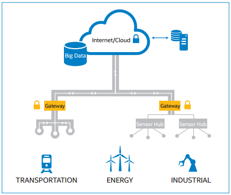

SandBox
==

Connectivity is critical to generating intelligence.

Intel Gateway Solutions for IoT provides:

- Connectivity up to the cloud and enterprises
- Connectivity down to sensors and existing controllers embedded in the system
- Preprocess filtering of selected data for delivery
- Local decision-making, enabling easy connectivity to legacy systems
- A hardware root of trust, data encryption, attestation, and software lockdown for security
- Local computing for in-device analytics.

Where are Gateways used?
Adaptive Analytics
Refine operational enterprise processes based on insights gained from analyzing and interpreting vast amounts of data
Transportation: Smart control systems can tell trains to slow
down based on a variety of constantly changing external data
inputs, such as weather, topography, location, distance from destination,
track conditions, or car-to-car communication indicating
another train is ahead.
• Energy: Devices can adjust the speed and blade pitch of wind
turbines to improve efficiency and reduce wear.
• Buildings: Adaptive analytics can improve the accuracy and
performance of systems used to monitor and manage energy
consumption, climate control, lighting, mechanical equipment,
and security.

Predictive Maintenance
Optimize equipment uptime and performance while reducing the time and labor associated with inspections and preventive maintenance.
• Transportation: Predictive maintenance will reduce the need to
remove transit vehicles, rail cars, or planes from service for routine
inspections and scheduled maintenance. Instead, operators will
be alerted when a piece of equipment requires attention.
• Energy: Operators can monitor generators, transformers, wind
turbines, and other critical equipment from central locations
and take action to mitigate stress, overheating, and other
malfunctions.
• Buildings: Sensors in a building’s electrical and mechanical
systems, such as lighting, climate control, plumbing, or security,
will alert engineers when a part or component needs attention,
enabling maintenance crews and contractors to focus on
imminent issues rather than around-the-clock inspection and
monitoring.

Energy
Complete power management tasks with finer precision and faster response times, resulting in energy conservation, usage prioritization, and better outage response.

Healthcare
Collect, compile, and analyze precise and objective data on cloud-connected smart devices to improve treatment and services in hospitals, doctors' offices, and homes.

In the Internet of Things (IoT), cloud-connected smart devices will
give manufacturers an alternative means of collecting, compiling,
and analyzing precise and objective data on device performance,
thereby reducing the time and expense of trial and accelerating
time-to-market. 

Smart Buildings
Transform and protect the home and office by designing in building automation features such as intelligence, modularity, and security.
• Energy savings: Integrated with the smart energy grid, smart
buildings and homes represent a huge opportunity to reduce
power consumption by businesses and families. Power providers
can take advantage of efficiencies based on the schedules and
usage patterns of building inhabitants. Smart power meters and
appliances will communicate with intelligent power sources to
help balance supply and demand. Green buildings, LEED certification,
and net-zero energy consumption will become increasingly
commonplace.
• Remote monitoring and control: Building operators and residential
consumers will be able to monitor utility consumption
and control heating, lighting, safety, and security systems from
offsite. For commercial buildings, that means being able to
monitor multiple properties from a centralized property management
location, communicate to onsite maintenance crews,
and take control of systems in a fire or other emergency.
• Predictive maintenance: Sensors in a building’s mechanical
components will alert engineers when a part needs attention,
reducing the time and labor costs associated with routine
inspections and preventive maintenance.
• Assisted living: As our societies’ demographics change, with
populations aging and life spans extending, the modern building
will need to support independent living at older ages. With
sensors, controllers, and intelligence, smart buildings can provide
telemedical solutions or other technical assistance for aging
people, enabling true ambient assisted living.

Transportation
Leverage wireless networks and cloud-based control systems to optimize performance and make immediate critical decisions to improve safety and reliability.

 Real-time equipment tracking: Cloud-based central control systems
will enable operators to pinpoint any piece of equipment.
• Inter-equipment communication: Much as PTC helps avert rail
accidents, planes can report turbulence to other planes, alerting
pilots to take appropriate precautions; urban mass transit vehicles
can report traffic delays or accidents.
• Predictive maintenance: Rather than simply alerting drivers,
vehicles will transmit defect data directly to engineers. Predictive
maintenance will identify components in need of repair, eliminating
the need to take equipment out of service for routine inspections
and preventive maintenance.
• Remote upgrades: Operators can upgrade software over the
air in hundreds of connected devices spread across hundreds of
vehicles simultaneously.
• Fuel management: System operators will have better visibility
into fuel consumption and efficiency, potentially saving millions
in fuel costs.
• Improved passenger comfort and convenience: Carriers can
offer more onboard amenities. Transit riders can know how soon
the next bus is coming. Air travelers can be alerted to delays via
their mobile devices before they leave for the airport.

• Safety: Connected devices in vehicles must be able to receive
software upgrades and patches in ways that do not impede their
safe operation.

Wind River Helix Device Cloud*: Product Overview
https://www.youtube.com/watch?v=_Q4GlqAf2m4
https://www.youtube.com/watch?v=x5RdXKxg3nA&list=PLV850jtTzoaKXSPLC1p2nmGtz7ZhwHa85
https://console.ng.bluemix.net/
https://developer.ibm.com/recipes/tutorials/intel-edison/
https://github.com/chipgarner/EdisonBluemixNode/blob/quickstart/main.js
https://www-ssl.intel.com/content/www/us/en/embedded/products/gateway-solutions/connecting-gateway-solutions-for-iot-to-the-ibm-iot-foundation-video.html

